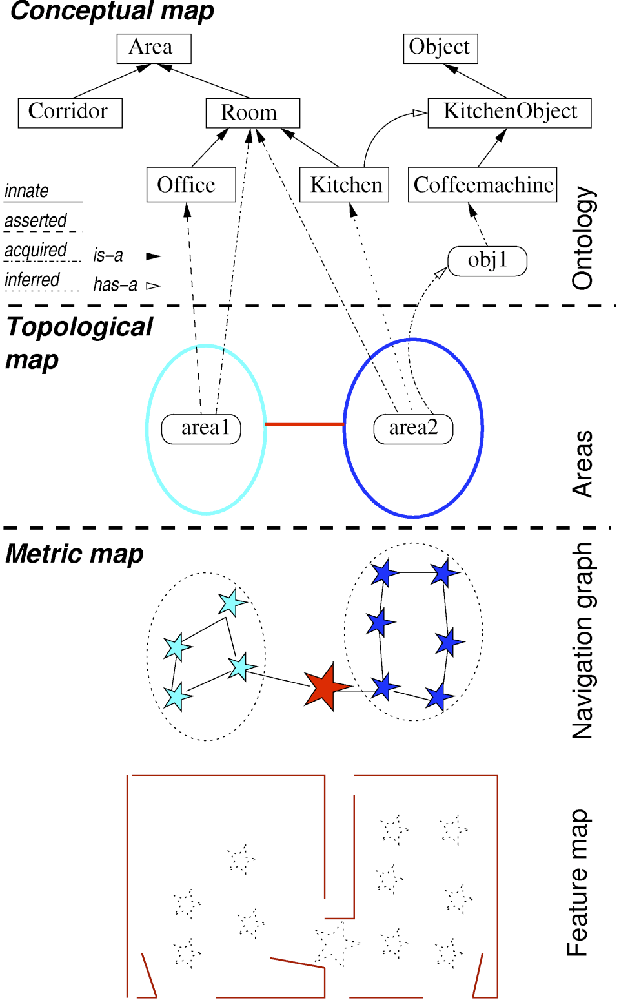
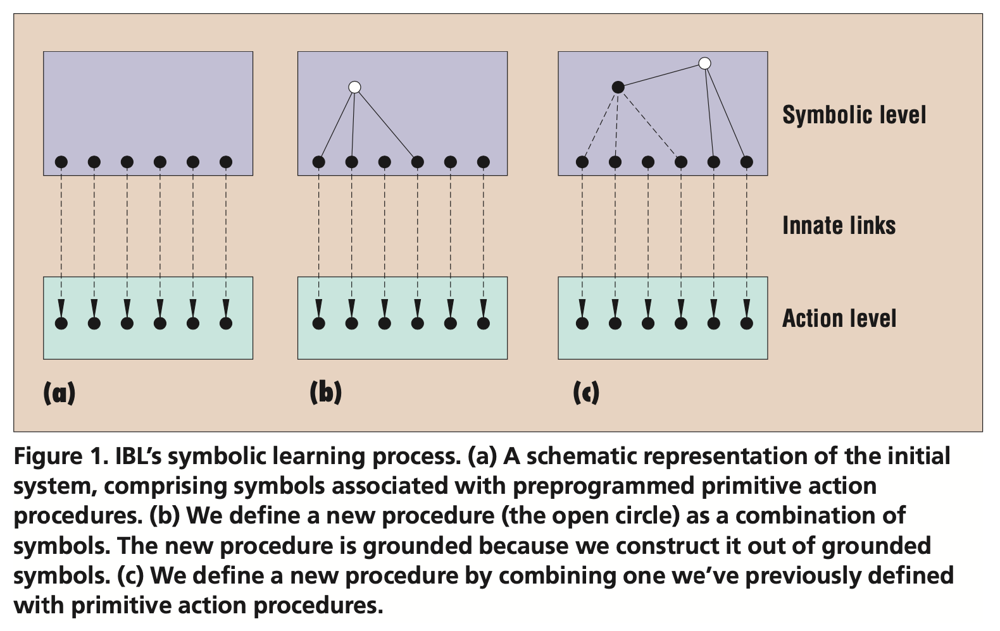
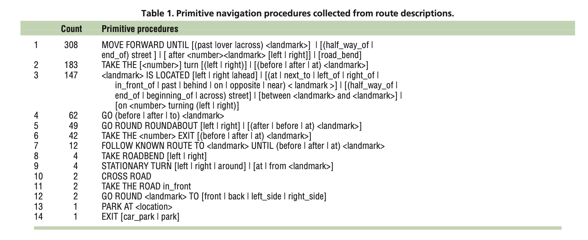
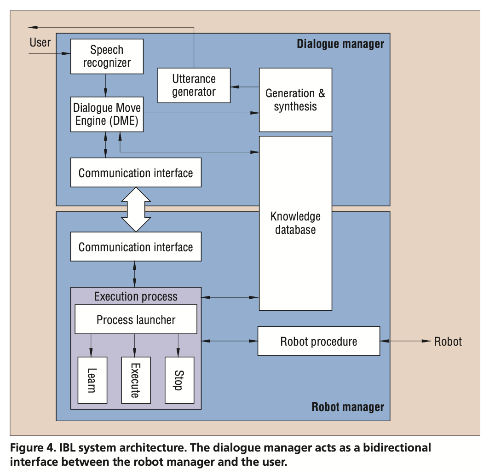

In this seminar we will look at two examples of classical robotic systems that learn from perceptual observations and linguistic interaction with humans.

The papers are slightly older and hence the way we would do language and vision modelling might be slightly different today. What are the differences? What are advantages and disadvantages of using either approaches?

Your main focus while reading and discussing these papers should be on the architecture required to build your interactive robots which is still how built interactive systems today. What components/modules are required? How are they connected with each other? What are the challenges of integrating distributed components, challenges with information flow and information fusion? How do these components relate to human cognition - is there anything missing?

## Kruijff et al.

G.-J. M. Kruijff, H. Zender, P. Jensfelt, and H. I. Christensen. [Situated dialogue and spatial organization: what, where... and why?](https://doi.org/10.5772/5701) International Journal of Advanced Robotic Systems, 4(1):125–138, 2007. Special issue on human and robot interactive communication.

### Simon's notes

* Mapping between how humans see the world and how a robot perceives it environment
* Augmenting representations of the robot through semantic information from interactions with a human (HAM, human augmented mapping)
* Knowledge representation for a robot?
* Wizzard of Oz studies: how humans communicate spatial knowledge?
* Spatial and functional representations: what is there and how it relates to each other or how the robot can operate in this environment (affordances)
* Spatial representation
  * modular, from ground up
  * features, navigation way-points, areas, concepts
  * conceptual map tells the robot what to expect in each area; cf. visual search
  * innate, asserted and learned knowledge
* Situated dialogue
  * natural for humans to communicate in language
  * establishing common ground in the shared perceptual environment
  * CCG, Hybrid Logics Dependency Semantics (HLDS)
  * rhetoric and referential referring: to the previous discourse or to the scene (or both), cf. co-reference resolution
  * ontology of discourse: classes of intent, semantic content and truth value
  * truth value is interpreted against the state of the robot: what modalities should be considered?
  * cross-modal information fusion which results in beliefs
* Human augmented mapping
  * Look around the room! Explore the corridor!
  * This is the office
  * Different training scenarios involving the robot interacting with the environment and with humans; similar to dialogue rules but now involve also generating and interpreting environmental actions
  * Reference and co-reference resolution:
    * Where is it?
    * Decision to generate a definite (unique) or indefinite description (existent).
  * Clarification: robot as an active communicator (does not only listen)
    * Improve the quality of spatial information: Is this a door?
  * Tasks
    * go-to, fetch-and-carry
    * reasoning is required, cf. Mattias Appelgren's forthcoming talk
* Implementation
  * distributed architecture for different modalities
  * BDI mediator
  * SLAM maps
  * ontological reasoning: RACER: TBox (terminological information), ABox (asserted information)
  * SIFT
  * people tracking
  * functional awareness: go to the door (so that the door can be opened)
* Desiderata
  * follow people
  * augment its knowledge through interaction: how to augment, how a human should explain?
  * take initiative for clarification
  * need to verify what the robot has understood: "ok" as feedback is not enough
  * problem of overgeneralisation (cup in the office = kitchen?)
  * reference: here, it, the correct object found in learning; eye-gaze detection required

Courses in robotics:

  * https://www.edx.org/course/hello-real-world-with-ros-robot-operating-system
  * Course at Örebro https://www.oru.se/utbildning/kurser/kurs/autonoma-robotar-och-ros-dt701a

Bulidng robotic systems: a layered approach 

-   Integration of (independent) processes
-   Information exchange and flow
-   Temporal processing
-   Information fusion
-   Increased abstraction of representations

### Discussion

#### 2022 groups

SLTC 2022 in Stockholm https://2022.sltc.se/

  - spatial mapping, vision: mathematical background
  - robots learning from humans, pre-programming does not work
  - bottom-up induction and top-down rule-based (the second paper argues for top-down rules), bottom-up learning is black-box, follow and track errors in a rule-based system, but ML allows us more natural communication, covers more situations; small vs large domain (independent)
  - To what degree general ML models would fit particular situation?
  - How good are neural models on learning on the go?
    * Adding a new clas to ML model?
    * Zero-shot learning and few-shot learning
  - What are challenges for applying neural networks to the robotic setting?
  - https://hci.stanford.edu/~winograd/shrdlu/
  - Tological representation of space
    * The division of modules is based on the practical considerations of available modules; but it would make sense to remove strong boundaries different levels; topological aspects at different levels
  - Modules used in robotis systems
    * The diagrams from both papers, spatial robotics and Kille
    * SUMO ontology https://www.ontologyportal.org/
  - Different ways of recognising objects/places
    * Lasers scans vs camera image; detect doors from camera vs from laser scans
    * Engineering constrains what systems are available
    * A system could verify an object/region from different modalities
  - The uses of the robots?
    * Directions
    * Personal assistants

#### 2021 groups

* G3: the environment the system can work in: how transferable and how to discretise environments
* to what degree objects are predictable of environments: the nature of ontologies
* visual search: kitchen predicts items; items predict kitchen
* how does the system prioritise recognition of objects?
  * processing considerations, visual search
* rule based representations or end-to-end representations? based on the applications that you want to do; explainability considerations; safety considerations
  * Bayesian models nicely combine rules with probabilistic reasoning; roboticists like them
  * deep learning constrained to virtual environments and artificial datasets, cf. HabitatAI
* formal representations: CCG/dependencies/AMRs (abstract meaning representations), Type Theory with Records (TTR)?
* What instructions should the robot be able to understand? Direct descriptions and commands, inference from conversations
* have a pre-defined plan of the building or build a map of a building? brittle, the world is changeable, we may not have a map of everything
* why classify rooms? useful for navigations, agent activity is different in different rooms; self driving cars

#### 2019, Vaishnavi

  - active learning: the robot queries about the missing knowledge
  - saliency and attention on objects: what is signgled out to be described
  - different humans will describe and focus on different levels of representation, cf. Lauria

#### ?

  - layers of the representations by the robot, p.3
  - conceptual map used for reasoning
  - Follow me: navigation and detection of objects
  - A coffee machine is detected, a coffee machine is in the kitchen, hence we are in the kitchen
  - Follow me! Look around! sets the attention for visual search what kind of procedures the robot should be taking
  - Detecting missing pieces of knowledge: ask clarification: the coffee machine on the first floor or the second floor?
  - paper demonstrates:
    * different layers of represnetation
    * learning of each representations
    * relating representations
    * also uses typical architectures and implements typical AI concepts for agents
	

#### Arild

2017-11-16

  - Human-like decomposition of space (human living environment)
  - Robotic represnetations vs human congitive categories
  - SLAM -> line detection (Q)
  - not enought to detect kitchen or the door (Q), actually it is: semantic role labelling
  - Person-detection an following
  - Multi-layer spatial map: SLAM -> line map -> navigation map -> topological map -> conceptual map (handcrafted ontology)
  - Dialogue: speech recognition, CCG, HLDS (hybrid logic dependency semantics)
  - Content mediation
  - Room is defined by the objects therein: objects (Q) semantic role labelling ignores this

#### Ana

Part of the CogX and Cosy projects: a typical architecture for robots; what kind of knowledge a robot needs to know

Human-augmented mapping technique: providing information through language

The layer architecture

Visual search: look around! The problem of classifciation.

Feature map

Navigation map: the gateways. It is very difficult to detect doors. https://www.youtube.com/watch?v=4iLKLJ74F40

Ontological map: handcrafted and static
  - Creating ontology
  - How to ask clarification questions: the kitchen, the kitchen on the first floor
  - How to update ontologies

Logic representations similar to TTR, feature-value pairs structured

Situated dialogue:
   - symbol grounding
   - speech acts

How SLAM works; fusing camera image with SLAM points; already done on Kinect: background removal

#### Isac

WOZ experiments

Figure 2: representational layers of a mobile robot

Hybrid logic dependency semantics: what does this remind you of?

Intention and propositional content and truth values

RACER: TBoxes (terminological boxes) and ABoxes (assertional knowledge)

The role of ontologies

The interaction between langauge and visual learning

A video of the system: http://videolectures.net/aaai07_zender_htsn/ (doesn't seem to work on my computer)

## Lauria et al.

S. Lauria, G. Bugmann, T. Kyriacou, and E. Klein. [Mobile robot programming using natural language.](https://doi.org/10.1016/S0921-8890(02)00166-5) Robotics and Autonomous Systems, 38(3–4):171–181, 2002.

### Simon's notes

* how to programme a robot through instruction
* instruction-based learning: more effective?
* reinforcement learning, imitation learning
* communicative strategies
  * chunking (of information)
  * repair
  * detect missing information
  * user adaption
* basic actions (chunks, sensory-motor primitives, need to be matched with the task), build more complex ones
* Symbolic learning
  * symbols grounded in actions; complex symbols; grounding by inheritance (cf. Figure 1)
  * Semantic interpretation
  * route planning: are actions from a description executable S\**i Aij S*\*j formally verified; PREDICTION function
  * generation of procedures: programmes containing actions; the ACTION function
* Architecture
  * dialogue manager and robotic manager (process manager and procedure execution manager)
* Experimental environment
  * a small town
  * describers providing free instructions to a human-controlled robot; re-use previous descriptions as much as possible
  * extract primitive navigation procedures based on the domain data
    * useful
    * problem that they are not general, the question of granularity required
    * new primitives might be required during continuous learning
  * behaviour based control (connected with a classical AI) is able to deal with uncertainty
  * instructions can be verified and therefore removed if the environment changes

Instruction Based Learning (IBL)

[@Lauria:2001] and [@LauriaEtAl:2002b]

Primitive Actions

Primitive Actions

### Discussion

#### 2021, groups

* The second breakfast club, G3: primitives and parameters: "the church" how much is pre-defined and how much learned?
* what are the limits of such learning?
* "remote-brain" or "distributed brain"

#### Elin

  - simple actions to complex actions
  - knowledge represented as Python scripts
  - actions and states
  - simple actions are grounded
  - complex are not grounded directly but through simple actions
  - compositionality and DRS
  

#### Amelie

  - IBL: programming a robot with language
  - builds on previous knowledge
    *  primitive sensory motor procedures
    *  actions
  - a new piece of programme code composed of primitive actions
  - the symbols are grounded in actions
  - inheritance of actions ensures inheritance of grounding
  - very natural way of communicating for humans (?)
  - SAS: precondition state, action, state (FSA?)
  - corpus collection, 24 subjects
  - Go to the library? - I don't know how to go to the library.
  - extracted simplified procedures from the dialogue corpus of free converstaions
  - the dialogue manager: using DRS (?)
  - robot manager: controls the robot:
  - there are two control systems: dialogue and action, do we need two (?)
  - DM representations are translated to actions of the action manager: two kinds of representations (?)
  - Are they really using unconstrained speech (?)
  - Using behaviour based control (?)
  - Not full range of AI capabilities, e.g. the planning is done by humans
  - The system can verify the programme before it executes it.

#### Danila

2017-11-16

  - Naive user programming a robot with natural language
  - Learning through interaction is crucial
  - Instruction based learning (through language)
  - Language: chkunking, sequencing, repairing: (Q) interaction strategies, how to learn
  - We need some pre-programmed sensory-motor actions: but these could be also learned (Q) grounding
  - speech, tagging, parsing, semantics, robot programming instructions (Q) see Matuszek
  - hierarchical nature of language and cognition; hence grounding is propagated higher-up in the cognition
  - route planning such that states are connected together
  - system architecture: dialogue manager and robot manager: (Q) do we need the two? they can be separated as two different processes
  - Corpus of instructions; reuse previously used descriptions
  - Instructed that they are providing instrcutions to a human robot operator rather than a robot: not to adapt their language (Q)
  - 14 primitives, generalised over some parts to combine several instructions
  - Underspecification and ambiguity; problems with a model of instructions based on initial state - final state; sometimes we omit the middle
  
  

#### Marta

Instruction Based Learning (IBL) through natural language instruction

SiASj :: Preconditions Action Postconditions; could be modelled with FSA

GSL: grammar specification language: unification grammar and logical forms, worked with Johan Bos; DRS strcutures; Information state approach to dialogue management

Two components:
   - dialogue manager
   - robot manager

Very nice graph of the control vs. dialogue systems

Extending the corpus (if we want to add new basic actions)

Behaviour-based approach:
  - does not need to do planning;
  - does not need to do high level reasoning
  - perhaps this is better as we do not plan ahead a lot of utterances (Chris Howes, Ruth Kempson)
  - can model unpredictable behaviour better

- The role of clarification and acknowledge in learning through dialogue
- How to update symbloic and non-symbolic knowledge
- What are the update strategies from dialogue to the knowledge representation model
- Hierarchical cognition allows us to express more complex information with less, same as examples with recursion learning, foxes, rabits and cabbage

#### Toni

  - How does the system scale?
  - Do humans learn language in the same way?

Suggestion for a project: create adialogue  system that would generate route directions in the linguistics building (for which we have a map of); what are important features of the building that one would include in the description (also related to Kelleher's work on attention, next seminar)
