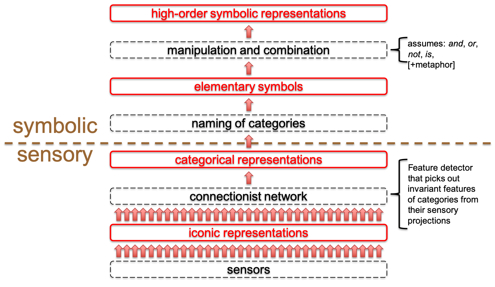
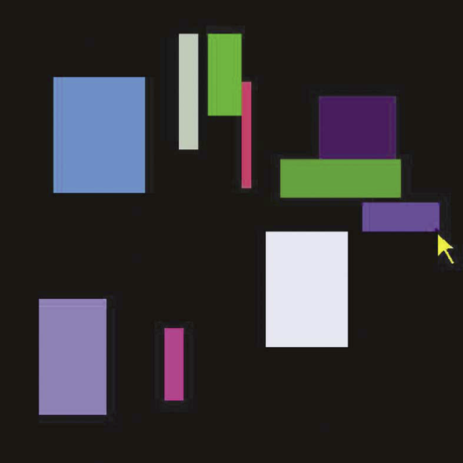

## Harnad

S. Harnad. [The symbol grounding problem.](https://doi.org/10.1016/0167-2789(90)90087-6) Physica D, 42(1–3):335–346, June 1990.

(Roy 1990) introduces the notion of grounded natural language from a theoretical perspective. What are the main points he presents and how do they relate to the distributional and distributed representations of language we use in language technology?

### Simon's notes

 - the context of the paper: symbolic AI, symbolic NLP; behaviourism in psychology, early applications of neural networks
 - sees language as a symbolic system: NL syntax follows distributional or symbolic rules; certainly symbol combinations on the surface but the process could be distributional
 - complementarity of the symbol system and connectionist system
 - top-down and bottom-up systems: work in complementarity as grounded symbols are manipulated (cf. learning to compose); compatible with behaviourism
 - iconic representations discriminate (one pattern from another); categorical identify (i.e. a horse) symbolic representations require structure / compositionality (zebra = horse & stripes)

Perceptual grounding

Image from J. D. Kelleher. How to preposition a robot: A case-study in symbol grounding. Presentation at the University College Dublin Research Seminars, 2010.

### Discussion

## 2022 groups

  - Group 5: Harnad, theoretical background, implementation details?
  - Iconic, categorical represnetations (objective? domain specific? what the software is going to be used for?)
  - Symbolic and connectionist systems: the difference?
    * neural networks
    * symblic "successes of AI"
    * a combination of both
    * top-down and bottom up, inductive vs deductive
    * symbolic systems can reason with rules, but the meaning of symbols is arbitrary
    * discrete vs continuous; reasoning with both? not possible to reason deductively with continuous representations? inference with neural models for logical problems (finding patterns of sentences rather than reasoning)
    * formal symbol systems that are grounded; proof-theoretic and model-theoretic approach to logic
    * can a large model from syntax generalise semantic information; semantic information extracted from syntax alone
    * can we generate a model from a large-enough corpus of text such that it will be the only model
    * current NLP models are pattern finders and do not apply reasoning; this is inherent in the architecture, we need better architectures
    * does increasing the size of the model lead the model to make inferences or just remembering more patterns?
    * computational creativity: re-combination of previous patterns using probabilities knowledge
    * a hybrid systems keeps the best of two worlds
    * distributed semantics: embeddings, connectivity
    * language as a string of symbols, to what degree strings can be modelled with word-embeddings?
    * symbolic system allows us to communicate more efficiently; categories to generalise information
    * what is a feature determines where continuous becomes discrete?
    * features that are important for different categories: feature selection
  - The need of grounding for understanding language; NLP performs well without grounding?
    * Grounding for the POS tagger?
  - What is understanding language? Is grounding representations understanding?
  - What is the correct grounding framework or in what modlaities can we/must we ground language?
  - Humans also impoverished access to modalities sometimes, so manipulation of symbols is a very impoverished way of accessing semantics, one kind of
  - But we are grounded partially, so we are able to connect are grounded and ungrounded experiences of language
  - Ferrone, Lorenzo, and Fabio Massimo Zanzotto. "Symbolic, distributed, and distributional representations for natural language processing in the era of deep learning: A survey." Frontiers in Robotics and AI 6 (2020): 153.

#### 2021 groups

 - G4-FDP Model: human or computational? Related?
 - Grounding: bottom-up and top-down: in order to connect the meaning to words you need to consider both levels
 - Is natural language symbol manipulation or not?
 - G1 Compositionality of grounding: the granularity of grounding; do we need to experience all parts of the grounded concept?
 - Are all words grounded (to the same degree)? Determiners, nouns, adjectives, relations? How do we ground actions: objects first? Easy to ground colours and shapes - what about abstract concepts?
 - Distributed or distributional representations
 - Grounding for visually impaired people? Other features: shape, texture?
 - G6: Iconic and categorical representations: difference?
 - SHRDLU, Shakey and Flakey: T. Winograd. Understanding Natural Language. Edinburgh University Press, 1976.

#### 2019 Miriam

  - Behaviourism and cognitivism
  - Computation as symbol manipulation, rules
    * Symbolic vs distributional
  - Symbols connected with the world
  - Chinese room, working with a dictionary
  - Symbol vs entity it represents, sensory-motor system
  - How to pass a Turing test? How to verify and experience an object?
  - Grounded and non-graded representations
    * model based vs distributional semantics
  - Meaning is achieved through grounding
  - Iconic and categorical representations
    * Iconic, discriminative
    * Categorical, identifiable
    * Levels of grounded representations?
  - Sensors, motors, the capacity to interact with the world
  - Detect, categorise, identify and act upon the entities that the symbol refers to
  - Feature dectors: inborn or learned
  - Learning based on trial and error guided from feedback (correct vs incorrect categorisation)
  - Are all words grounded in perception and action?
  - Formal test: can we interpret the representations
  - Behavioural test: is the behaviour okay? Discriminate, identify, manipulate...
  - Where is the meaning? Agent-relevant or out there?
  - Connectionism as a solution
  - Are all concepts experienceable and groundable?
  - Grounding in perception and grounding in a language model

#### ?

  - Symblic vs connectionist
  - Cognitivism vs behaviorism: impossible to form theopries about whatagent has in mind; cognitivism underlines behaviour
  - Symbolic systems: arbitrary symbols, rules, incremental structure
    * Compositeness (meaning of the whole is the meaning of its parts) and Systematicity (derive semantic meaning from separate parts)
    * Not all symbolic systems have the property of compositeness and systematicity
  - Connectionist systems:
    * Symbolic way of modelling the language and the brain
    

#### Ida

  - Grounded
  - Symbols: a triangle; symbol is a representation of the object, not the object itself
  - Cognition as symbol manipulation: Symbols: tokens, agreed rules, composed symbols/composite symbol-token strings; semantics: describing state of affairs
  - Cognition as connectivism: not a symbol system;
  - Harnad: we need a hybrid model:
    * discrimination: iconic representations
    * identification: categorical representations
    * symbols connected to non-symbolic representations
  - Why is a connectionist model a good candidate?

   - Why iconic representations?
   - Why neural networks as mediators of non-categorial representations and categorial representations?
   - Compositionality of grounding?

#### David

Behaviourism

Connectivism

What is a symbol system: this view is very familiar to NLP community

Neural networks: 26 years ago, deep learning has now returned

Symbols and nets: symbols better for language tasks and nets are better for the sensory motor tasks

The Chinese room experiment thought experiment:
  - Round 1: you learn Chinese from the outputs of the system where you know another language
  - Round 2: you learn Chinese from the outputs of the system where you don't know another language, i.e. symbols are ungrounded, not connected to the world

Represnetations:

  - Iconic representations: directly connected to the world; sensory readings, features
  - Categorical representations: cognitive abstractions but of course based on grounded representations; there is an interplay between the two in terms of how much they contribute, e.g. discussion on the nature of objects
  - Symbolic representations
  - Taxonomic representations

Symbolic model is ungrounded
Connectionist model is grounded but not compositional
   - Horses, stripes = zebras ???
   

#### Wafia

The paper might be a bit old, but it is still very relevant as it is still a central research quetsion in linguistics, computational linguistics, philosophy and AI.

The Chinese Room Experiment, Searl

Symbolism and connectivism: similar divide in computational linguistics

Symbol system: cf. Computational Semantics course

Connectionist system: artificial neural networks from ML, Shruti, Networks and Types project

Neural Networks are slow?

Are neural networks symbolic? According to Harnad thay fail the composition criteria.

Chinese room: difficult (trying to learn Chinese on the basic of bilingual dictionary) and impossible version (learning Chiense as a native speaker, from data?)

Top down (symbolic) and bottom up (connectioninst)

Levels of representations:

  - Iconic representations - why do we need these?
  - Categorical representations: elementary symbols - what are elementary symbols?
  - Higher-order symbolic representations
  
  This will become very relevant for the TTR lectures next week.
  
Symbols are not grounded only on arbitrary shapes but their grounding is based on non-arbitrary shapes of the iconic representations. What does this mean?

"The symbol menaing are not parasitic on the meanings in the head of the interpreter but intrinsic to the dedicated symbol system itself."

## Roy

Deb Roy. 2002. [Learning visually-grounded words and syntax for a scene description task.](https://doi.org/10.1016/S0885-2308(02)00024-4) Computer speech and language, 16(3):353–385. 

Roy (2002) describes a computational implementation of how scene descriptions are connected to the visual representations of abstract scenes. It describes the grounding in a Bayesian probabilistic approach which provides an intuitive description of how representations at different levels of language are grounded. How is grounding implemented in practice? What techniques from natural language processing that you know from before are applied and how they are extended?

### Simon'd notes

* DESCRIBER, grounding: visual scenes \~\~> transcribed descriptions
* data \~\~> learning \~\~> NLU \~\~> NLG \~\~> descriptions
* Computer generated rectangle scenes
* NLG: generate a description to identifies the target objects and excludes all its distractors
* Multi-layered grounding: words - word classes - syntactic patterns
* Separate simple from complex descriptions (multiple objects): syntax learned in stages
* semantically and syntactically words belong to the same classes
  * words of the same class do not co-occur syntactically: co-occurrence is distortion
  * words of the same class have similar grounded features: mju and sigma for how features associates over words
  * estimate the same but for scenes and words that do not occur in the utterance; background model, i.e. presence of feature unconditioned on a word
  * KL divergence between the two
  * Semantic association vector: for each word create a feature vector of KL distances; calculate distortion between the semantic association vectors (take one as negative) just as in the syntactic comparison above
  * Combine syntactic and semantic distortion into a single weighted metric
  * Calculate KL divergence on multi-variate distribution, for several features
  * Features are associated from words to classes of these words
  * For each word estimate a Gaussian distribution over the features identified for its class (this is our classification model, previously we were looking at how to associate features)
* train a statistical model of class sequences
* summary on p.18
* generation
  * syntactic constraints (word order), semantic constraints (features are grounded) and contextual constraints (must be distinguishing)
  * For each bi-gram sequence of classes, for each class choose the most likely word given the target object: the, the rectangle, the green rectangle, the large green rectangle, the large light green rectangle...
  * Syntactic and semantic constraints: estimate the fit of each description to the target object: the likelihood of a sequence of words to refer to the features of the object
  * Contextual constraints and ambiguity of a description; fit of a description to an object against the best fitting competing object\
    ψ(Q)=fit(x_target,Q)−max∀x=/=target fit(x,Q)
  * Combine the scores from syntactic and contextual constraints with a weighted sum
* Grounding spatial clauses / descriptions

Words as classifiers

A scene:

Training instances

-   Vector of real-valued features representing the objects in the scene: r, g, b, hw_ratio, area, x, y mm_dimension
-   Natural language descriptions
    -   The pink square
    -   The light blue square
    -   The brightest green rectangle
    -   The purple rectangle to the left of the pink square
    -   The narrow purple rectangle below and to the right of the blue
        square

Learning

-   Cluster words into classes (using probabilistic models):
    -   Based on word distributions: words within a class co-occur infrequently with other words in that class
    -   Their association with semantic features
    -   A combination of both
-   Statistical bi-gram model of classes (encodes word order constraints)

 Generation

-   For each bi-gram sequence of classes, for each class choose the most likely word given the target object:
    -   the, the rectangle, the green rectangle, the large green rectangle, the large light green rectangle ...
-   Estimate the fit of each description to the target object: the likelihood of a sequence of words to refer to the features of the object
-   Contextual constraints and ambiguity of a description:\
    $\psi(Q) = fit(x_{target},Q) - \max_{\forall x \neq target}fit(x,Q)$
-   Combine the scores from syntactic and contextual constraints with a weighted sum
-   Evaluated by 3 human judges to select the target object given a
    description:
    -   human-generated: 89.8%
    -   machine-generated: 81.3%

Further reading and resources

Using the words as classifiers approach with robots:
  - Simon Dobnik. 2006. [Learning spatial referential words with mobile robots.](https://gup.ub.gu.se/publication/289797?lang=en) In Proceedings of the 9th Annual CLUK Research Colloquium, pages 1–8, Milton Keynes, United Kingdom. The Open University.
  - Simon Dobnik. 2009. [Teaching mobile robots to use spatial words.](https://gup.ub.gu.se/publication/270997) Ph.D. thesis, University of Oxford: Faculty of Linguistics, Philology and Phonetics and The Queen’s College, Oxford, United Kingdom.
  - Erik de Graaf. 2016. [Learning objects and spatial relations with Kinect.](http://hdl.handle.net/2077/66207) Master’s thesis, Department of Philosophy, Linguistics and Theory of Science. University of Gothenburg, Gothenburg, Sweden, June, 8th. Supervisor: Simon Dobnik, examiner: Richard Johansson, opponent: Lorena Llozhi.
  - Simon Dobnik and Erik de Graaf. 2017. [KILLE: a framework for situated agents for learning language through interaction.](https://gup.ub.gu.se/publication/253950) In Proceedings of the 21st Nordic Conference on Computational Linguistics (NoDaLiDa), pages 162–171, Gothenburg, Sweden. Northern European Association for Language Technology (NEALT), Association for Computational Linguistics. [Eric's code](https://github.com/masx/Kille)
  - José Miguel Cano Santín. 2019. [Fast visual grounding in interaction: bringing few-shot learning with neural networks to an interactive robot.](http://hdl.handle.net/2077/62035) Masters in language technology (mlt), 30 hec, Department of Philosophy, Linguistics and Theory of Science (FLOV), University of Gothenburg, Gothenburg, Sweden. Supervisor: Simon Dobnik and Mehdi Ghanimifard, examiner: Aarne Ranta. [Jose's code](https://github.com/jcanosan/Interactive-robot-with-neural-networks)
  - José Miguel Cano Santín, Simon Dobnik, and Mehdi Ghanimifard. 2020. [Fast visual grounding in interaction: bringing few-shot learning with neural networks to an interactive robot.](https://gup.ub.gu.se/publication/294796?lang=en) In Proceedings of Conference on Probability and Meaning (PaM-2020), Gothenburg, Sweden, pages 1–9, Gothenburg, Sweden. Association for Computational Linguistics (ACL), Special Interest Group on Computational Semantics (SIGSEM).

Words as classifiers + formal representations

  - Cynthia Matuszek, Evan Herbst, Luke Zettlemoyer, and Dieter Fox. 2012. Learning to parse natural language commands to a robot control system. In Proceedings of the 13th International Symposium on Experimental Robotics (ISER).
  - Simon Dobnik and Robin Cooper. 2017. [Interfacing language, spatial perception and cognition in Type Theory with Records.](https://gup.ub.gu.se/publication/251413) Journal of Language Modelling, 5(2):273–301.
  - Simon Dobnik and John D. Kelleher. 2017. [Modular mechanistic networks: On bridging mechanistic and phenomenological models with deep neural networks in natural language processing.](https://gup.ub.gu.se/publication/262955?lang=en) In Proceedings of the Conference on Logic and Machine Learning in Natural Language (LaML 2017), Gothenburg, 12–13 June 2017, volume 1 of CLASP Papers in Computational Linguistics, pages 1–11, Gothenburg, Sweden. Department of Philosophy, Linguistics and Theory of Science (FLOV), University of Gothenburg, CLASP, Centre for Language and Studies in Probability.
  - Arild Matsson. 2018. [Implementing perceptual semantics in type theory with records (ttr).](http://hdl.handle.net/2077/62521) Masters in language technology (mlt), 30 hec, Masters in Language Technology (MLT), Department of Philosophy, Linguistics and Theory of Science. University of Gothenburg, Gothenburg, Sweden, September 24. Examiner: Peter Ljunglöf; supervisors: Simon Dobnik and Staffan Larsson; opponent: Axel Almqvist. [Arild's code](https://github.com/arildm/imagettr)
  - Arild Matsson, Simon Dobnik, and Staffan Larsson. 2019. [ImageTTR: Grounding Type Theory with Records in image classification for visual question answering.](https://gup.ub.gu.se/publication/284011?lang=en) In Proceedings of the IWCS 2019 Workshop on Computing Semantics with Types, Frames and Related Structures, pages 55–64, Gothenburg, Sweden. Association for Computational Linguistics.
  - Ronja Utescher. 2019. [Visual TTR - modelling visual question answering in type theory with records.](https://www.aclweb.org/anthology/W19-0602) In Proceedings of the 13th International Conference on Computational Semantics - Student Papers, pages 9–14, Gothenburg, Sweden. Association for Computational Linguistics.

Grounding sequences of words bottom up: 

  - Mehdi Ghanimifard and Simon Dobnik. 2017. Learning to compose spatial relations with grounded neural language models. In Proceedings of IWCS 2017: 12th International Conference on Computational Semantics, pages 1–12, Montpellier, France. Association for Computational Linguistics. [Mehdi's code](https://github.com/GU-CLASP/spatial-composition)

Study of grounding in human language acquisition:

  - Deb Roy. 2011. [The birth of a word.](https://www.ted.com/talks/deb_roy_the_birth_of_a_word) Talk, TED: Ideas worth spreading.
  - Brandon Cain Roy. 2013. [The birth of a word.](https://www.media.mit.edu/publications/the-birth-of-a-word/) Doctor of philosophy in media arts and sciences, Program in Media Arts and Sciences, School of Architecture and Planning, Massachusetts Institute of Technology.

### Discussion

#### 2022 groups

  - the grounded NLP pipeline
  - the maths
  - approaches for word clustering: semantic and distributional; related to the previous points
  - multi-relational phrases, how to ground them? e.g. "to the left of"
  - FSM for multiple clauses
  - 200 utterances but only 1 person who produced the dataset; we need more describers
  - visuals, colourful squares are simplistic; need a more advanced visual part
  - transparent non-neural framework (vs neural network), can examine features
  - does the system understand language now
  - construction grammar, categories; cluster instances to existing categories and if an example is too different from them, create a new category
  - generation of utterances with speech
  - What are good features for graounding: specific geometric features in Roy vs visual features; the type of features will leave to different grounding success
  - fetaures are rperesented as Gaussian distributioon; but this is simplifaction
  - engineering decisions of features affect modelling; but we bring our knowledge to the modeeling hoping that it is correct
  - need to make all the calculations for every word in every class and every feature

#### 2021 groups

* The pipeline of the system; generating the text; where does grounding happens; during learning or generation over a new scene?
* Learning language in real context with intentions

#### Linnea

  - Describer, images of rectangles automatically generated
  - Learning grounding and syntax (simple vs complex utterances)
  - Feature selection, pre-defined features
  - Learning word-classes
  - Dsitributional clustering; words in similar classes will be used in similar contexts and exlcusive of each other
  - A model a combination of visual and distirbutional cues
  - Categories on p.366
  - Categories defined by features, sequences of categories, most likely classes of sequences

#### ?

  - Describer: artificially create the dataset
  - supervising the process of learning buy splitting the task into modules
  - introducing certain features at certain modules only, e.g. spatial features of Regier

#### Sylvie

  - 

#### Yuri

  - Learn grounded meanings of words
  - Learn structure

  - Phrases that best describe the target objects: 8 features (colours and spatial features (things that might be releavant for identifying objects)
  - Speech transcription (but in the earlier paper this was done automatically)

Learning classes
  - Similar words would cluster in the same context; cluster the words accoring to the context; could try vector space models
  - Feature association clusters; what features are predictive for a particular class of words: words will have similar clusters
  - Linear combination of the previous two metrics (syntax, approach 1 and semantics approach 2)
  - Feature selection: what features are relevant for classes; some words do not have relevant features, e.g. -est, the

Class-based bi-gram model models syntax

What utterance is the least ambiguous given an object?

Complex utterances
(...) near the (...): use simple parsing in the complex utterances

Generating relative spatial clauses: i.e. typical spatial descriptions

Evaluation:
  - Given a description, choose an image
  - 200 machine generated and human generated descriptions

Discussion:
  - Small size of the task: only 1 human, more people should be included
  - 89.8% human accuracy: this is taken as a top baseline
  - the question of vagueness of expressions; humans may find them more acceptable than they would be given the classifier accuracy
  - a lot of supervision in the learning: simple vs complex categories, attentional vector sum model
  - replicate the model with image classification, larger corpus

#### Ana

A simple task? An incredibly difficult task! Wants to be unsupervised.

Simple vs. complex utterances? Are we not there distinguishing between reprrsentational layers and therefore making the task supervised, i.e. the outputs from the first layer asre taken as inputs on the second layer.

The learning contains visual features which introduces a supervision element to the learning.

Feature selection? Data driven or interesting linguistic generalisation?

Complicated maths: Bayesian reasoning

Spatial relations: attentional vector sum model is used directly (AVS) rather than implementing learning on the same features as learning objects

Possible project to repeat (on a smaller scale).
